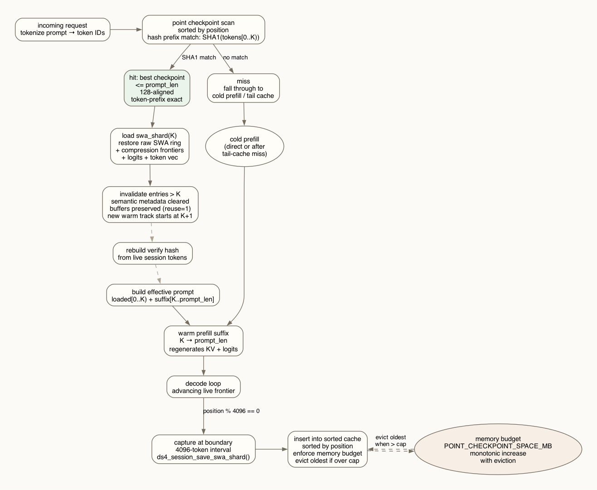
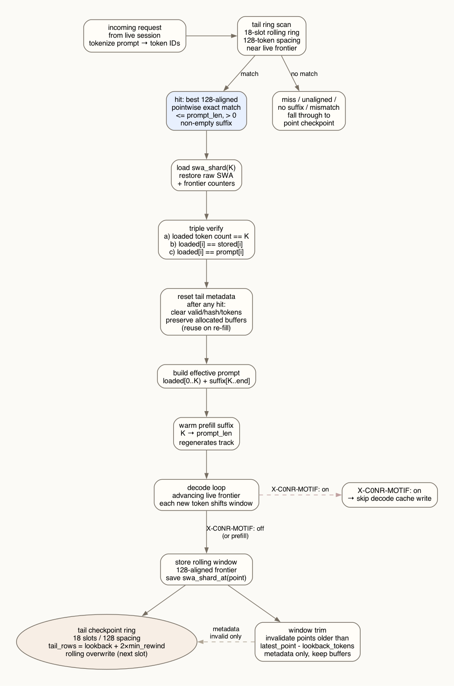

# DS4C In-Memory Cache

In-memory point checkpoints and live tail-cache for single-session DS4C.

> **Design target**: Designed for machines with **256 GB or more** of unified/system
> memory. The default checkpoint budget alone is 8192 MiB; enabling tail-cache
> adds further per-request memory via the rolling swa_shard ring. On smaller
> machines evaluate memory pressure before enabling.

## Overview

Two complementary caches, both 128-token-aligned and correctness-proven:

| Cache | Purpose | Interval | Storage |
|-------|---------|----------|---------|
| **Point checkpoint** | Coarse persistent cache | 4096 tokens | Fixed-size array, sorted by position |
| **Tail cache** | Dense near-frontier cache | 128 tokens | 18-slot rolling ring |

Neither changes the model's raw-SWA window or attention geometry. Both use
exact token-prefix matching (SHA1 hash), not rendered-text SHA1.





## Point checkpoint

### Design

- Captured at `POINT_CHECKPOINT_INTERVAL_TOKENS` boundaries (default 4096)
- Token-prefix exact match (SHA1 of token IDs)
- Sorted array, insert by position, evict oldest when over budget
- Memory budget: `--kv-point-checkpoint-space-mb` (default 8192 MiB)

### Budget and eviction

Budget must support at least **10 checkpoints** to be useful. A budget too small
for this many entries defeats the purpose — the cache would evict entries faster
than they accumulate meaningful reuse.

Per-checkpoint size depends on model geometry and context depth:
```
swa_shard bytes ≈ N_LAYER × min(point, N_SWA) × N_HEAD_DIM × 4
                 + token IDs + logits + frontier counters
```

Typical sizes for common configurations:

| Context | N_SWA | Approx per entry | 10-entry minimum |
|---------|-------|------------------|------------------|
| 32K     | 4096  | ~500–650 MiB     | ~5–6.5 GiB      |
| 128K    | 4096  | ~500–650 MiB     | ~5–6.5 GiB      |

The swa_shard saves only raw sliding-window attention rows (not compressed KV),
so it caps at `N_SWA` regardless of context depth. The default 8192 MiB budget
covers ~12–16 entries for typical models.

Eviction is **FIFO by position** (oldest first). Entries are sorted by ascending
token position; when budget is exceeded during insert, `entries[0]` (lowest
position = oldest) is evicted. Buffers are freed on eviction, not preserved.
No LRU scoring — position ordering is sufficient for monotonic checkpoint
progression.

### Lifecycle

```
request → tokenize → scan checkpoints → SHA1 match?
  hit → load swa_shard(K)
       → invalidate entries > K (metadata clear, preserve buffers)
       → rebuild verify hash from live session
       → build effective prompt then warm prefill
  miss → fall through to tail cache / cold prefill
  
prefill done → position % 4096 == 0 → capture swa_shard → insert sorted
```

### Compile-time geometry

`POINT_CHECKPOINT_INTERVAL_TOKENS`:
- `0` = disabled (also disables tail cache)
- `>= 2048` and `% 128 == 0` = valid

Startup validation refuses incompatible combinations (e.g. tail cache enabled
with point checkpoints disabled).

## Tail cache

### Design

- 18-slot rolling ring, 128-token spacing
- Covers `[latest_point - lookback_tokens, latest_point]`
- `tail_rows = lookback_tokens + 2 × min_rewind_tokens`
- Pointwise hit only: exact token-prefix match at a stored point with non-empty suffix
- No arbitrary rewind, no range restore, no LCP match

### Lifecycle

```
request → scan tail ring → pointwise exact match?
  hit → load swa_shard(K)
       → triple verify (count + token[i] vs stored + token[i] vs prompt)
       → reset ALL tail metadata (keep buffers)
       → build effective prompt then warm prefill
  miss → fall through to point checkpoint
  
decode progress → store 128-aligned frontiers (rolling window)
                → trim points older than lookback window (metadata invalid only)

X-C0NR-MOTIF: on → skip decode-time cache writes (control traffic)
```

### Ring dynamics

- `next` slot overwrites oldest (round-robin)
- Window trim invalidates entries before `latest_point - lookback_tokens`
- Full reset after any hit (single-track constraint)

## Runtime metadata

### `GET /__ds4/runtime`

Returns JSON with server identity, model name, context size, and log file paths
for downstream observability:

```json
{"ok":true, "server":"ds4-server", "model":"deepseek-v4-flash",
 "ctx":32768,
 "logs":{"stdout":"/path/to/server.log", "stderr":"/path/to/server.err"}}
```

### RSS reporting

Uses `task_vm_info_data_t.phys_footprint` (macOS Activity Monitor equivalent),
which includes Metal GPU buffer allocations unlike `resident_size`.

## CLI flags

| Flag | Default | Meaning |
|------|---------|---------|
| `--kv-point-checkpoint-space-mb N` | 8192 | Point checkpoint memory budget; 0=unlimited |
| `--kv-prefix-lookback-tokens N` | 0 | Enable tail cache over last N tokens |
| `--kv-prefix-lookback-min-rewind-tokens N` | 128 | Minimum rewind distance for tail hit |
| `--kv-cache-verbose` | off | Log active checkpoint metadata after events |

## Invariants

- 128-aligned positions only
- Token-prefix exact match (not text SHA1)
- `swa_shard` restore copies raw SWA + frontier counters, no tensor repair
- Semantic invalidation clears metadata, preserves buffers
- Buffer lifetime separate from semantic validity
- Motif decode updates skipped via `X-C0NR-MOTIF: on`

## Tested

- Apple Silicon M3 Ultra, 512 GB unified memory
- Metal backend only (CPU backend untested)
- `ds4_server_unit_tests_run()` passes all checkpoint/tail-cache tests
- `make ds4-server ds4_test && ds4_test` passes
